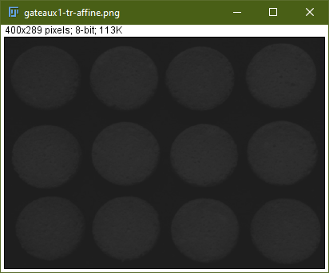

## Transformations ponctuelles

#### Transformation linéaire simple à une image

```javascript
    run("Duplicate...", "title=gateaux1-tr.png");
    getStatistics(area, mean, min, max, std);
    for (i = 0; i < getHeight(); i++) {
        for (j = 0; j < getWidth(); j++) {
            iprime = 255 / (max - min) * (getPixel(j, i) - min);
            setPixel(j, i, iprime);
        }
    }
```


Histogramme de l'image originale


Histogramme de l'image transformée


On peut voir

#### Transformation linéaire avec saturation à une image

```javascript
    run("Duplicate...", "title=gateaux1-tr-sat.png");
    getStatistics(area, mean, min, max, std);
    smin = 1
    smax = 180
    for (i = 0; i < getHeight(); i++) {
        for (j = 0; j < getWidth(); j++) {
            iprime = 255 / (smax - smin) * (getPixel(j, i) - smin);
            setPixel(j, i, iprime);
        }
    }
```


Histogramme de l'image originale


Histogramme de l'image transformée


On peut voir une plus grande répartition des niveaux de gris (0 à 255 contre 0 à 201 pour l'originelle), avec une
moyenne 2 presque fois plus grande (76 contre 131)

#### Transformation affine

```javascript
    run("Duplicate...", "title=gateaux1-tr-affine.png");
    getStatistics(area, mean, min, max, std);
    a=2
    b=127
    for (i = 0; i < getHeight(); i++) {
        for (j = 0; j < getWidth(); j++) {
            iprime = a * getPixel(j, i) + b;
            setPixel(j, i, iprime);
        }
    }
```

a=0.1 b=30



a=5 b=0


a=2 b=127


On peut conclure que la valeur de a définit l'éspacement dans l'histogramme, tandis que la valeur de b définit le début
des valeurs dans l'histogramme.

#### Contraste maximum

```javascript
    run("Duplicate...", "title=gateaux1-tr-contraste-max.png");
    getStatistics(area, mean, min, max, std);
    for (i = 0; i < getHeight(); i++) {
        for (j = 0; j < getWidth(); j++) {
            if (getPixel(j, i) < 30) {
                setPixel(j, i, 0);
            } else {
                iprime = 255 / (max-min) * (getPixel(j, i) - min);
                setPixel(j, i, iprime);
            }
        }
    }
```


## Égalisation d'histogramme

```javascript
    run("Duplicate...", "title=gateaux1-egalise.png");
    getHistogram(values, counts, 256);
    xValues = newArray(values.length);
    yValues = newArray(values.length);
    sum = 0;
    for (i = 0; i < 256; i++) {
        xValues[i] = i;
        yValues[i] = sum + counts[i];
        sum += counts[i];
    }
    
    for (i = 0; i < getHeight(); i++) {
        for (j = 0; j < getWidth(); j++) {
            hci = yValues[getPixel(j, i)];
            iprime = 256 / (getWidth() * getHeight()) * hci - 1;
            setPixel(j, i, iprime);
        }
    }
    
    getHistogram(values, counts, 256);
    xValues = newArray(values.length);
    yValues = newArray(values.length);
    ySumValues = newArray(values.length);
    sum = 0
    for (i = 0; i < 256; i++) {
        xValues[i] = i;
        yValues[i] = counts[i];
        ySumValues[i] = sum + counts[i];
        sum += counts[i];
    }
    
    Plot.create("Histogramme", "i", "i'", xValues, yValues);
    Plot.show();
    Plot.create("Histogramme Cumulées", "i", "i'", xValues, ySumValues);
    Plot.show();
```

Histogramme avant égalisation


Histogramme cumulées avant égalisation


Histogramme apres l'égalisation


Histogramme cumulées apres l'égalisation

